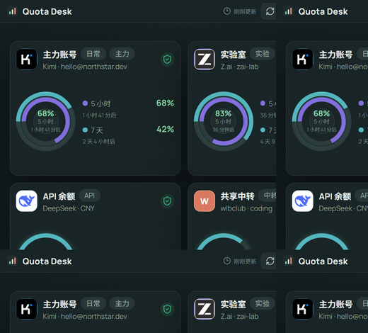
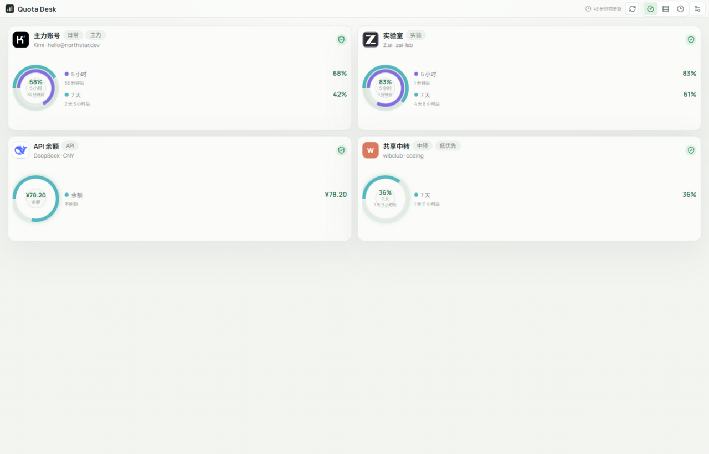
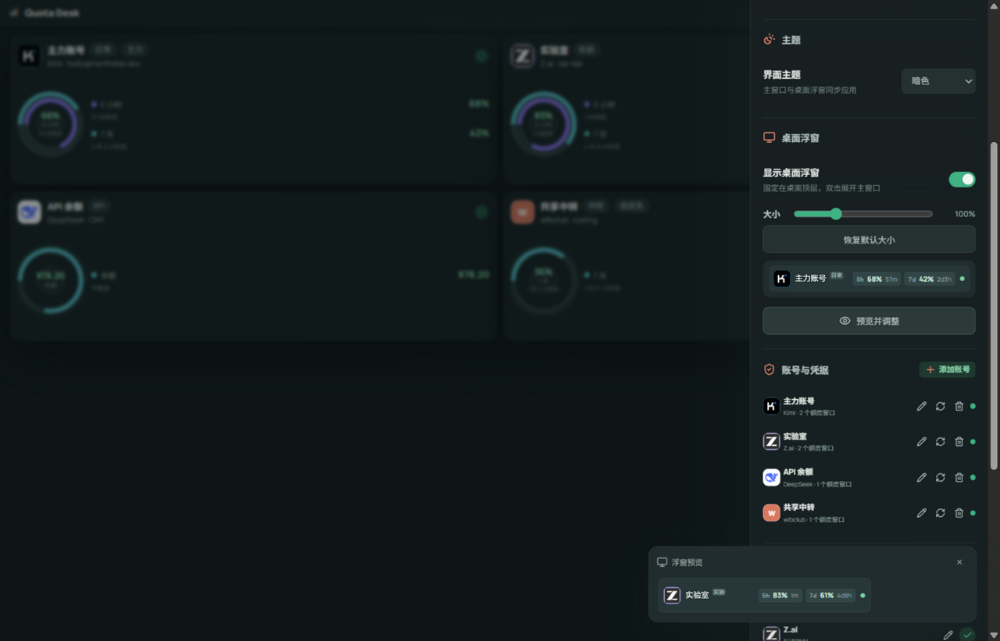
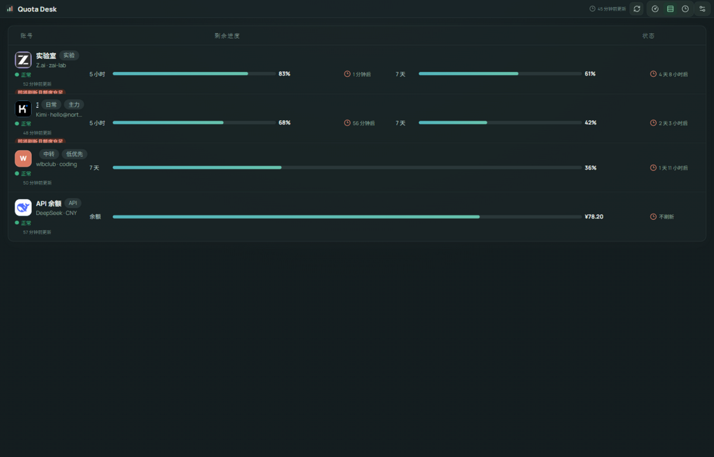
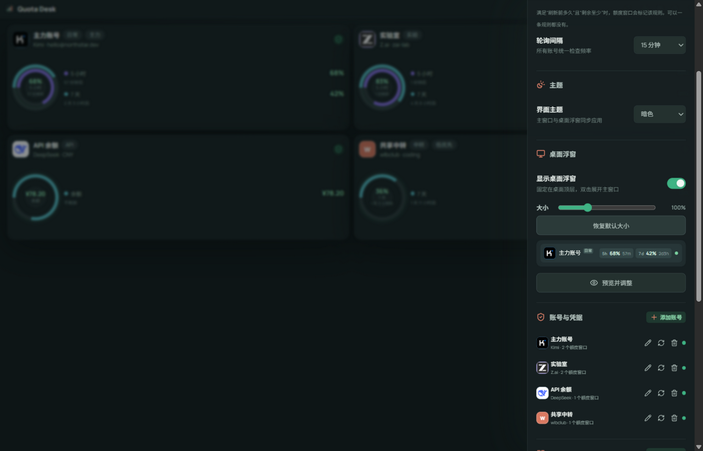
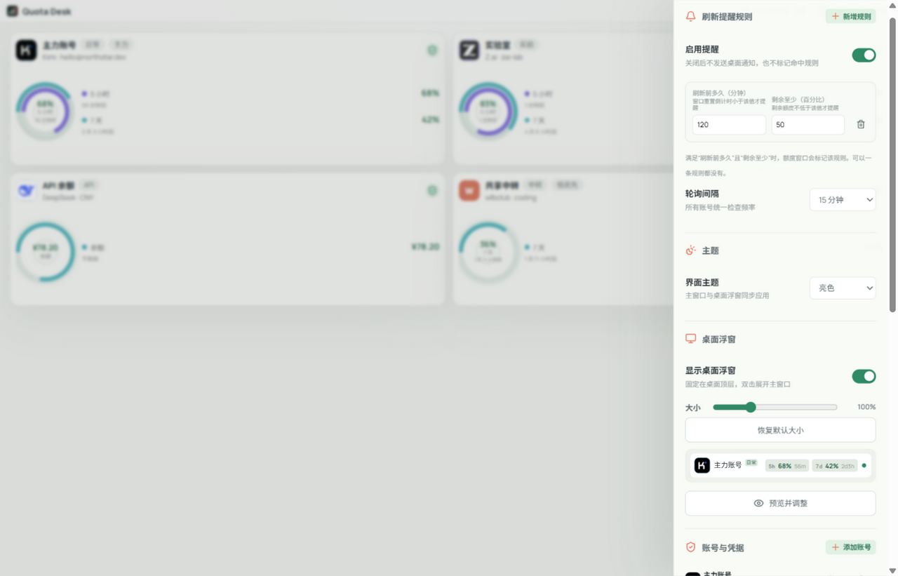

# Quota Desk

把所有 AI 编程订阅的额度集中到桌面，一眼看清每个套餐还剩多少、什么时候刷新——在额度被周期清零之前把它用掉。



## 解决什么痛点

如果你同时订阅了多个 Coding Plan（Kimi、智谱、DeepSeek、wlbclub、Grok……），大概率遇到过这种情况：

- 每个套餐的额度按**各自的周期**刷新：5 小时、7 天、1 个月，互不相同；
- 周期一到额度直接清零，明明还剩不少能用的额度，就这么被刷新掉了；
- 而下个周期又有新的限额，结果每个月都处在"这家用不满、那家已清零"的浪费状态；
- 想看各家额度，要么一家家登录官网控制台翻页，要么用 cc-switch 这类工具——它们能切换当前使用的 provider，但**不方便看**。

Quota Desk 就是为此做的：**专注"方便看"**。

- 主窗口聚合总览：每个账号一张卡片，每个额度窗口一个环，剩余量、刷新倒计时一目了然；
- 桌面浮窗常驻置顶，像网速条一样持续跳动轮播各账号额度，支持拖动、滚轮切换、80%–300% 等比缩放；
- 防浪费提醒：自定义「刷新前多久 + 剩余至少多少」规则，快刷新了但额度还剩不少时发桌面通知，提醒你抓紧用。

## 截图

| 暗色总览 | 亮色总览 |
| --- | --- |
|  |  |

| 桌面浮窗预览 | 行式明细 |
| --- | --- |
|  |  |

| 设置（暗色） | 设置（亮色） |
| --- | --- |
|  |  |

## 已支持的套餐

| 厂商 | 适配方式 | 额度窗口 | 凭据 |
| --- | --- | --- | --- |
| Kimi for Coding | 内置 | 5 小时 / 7 天 | API Token |
| Z.ai（智谱） | 内置 | 5 小时 / 7 天 / 1 个月 | API Token |
| DeepSeek | 内置 | 余额 | API Token |
| WLB Club | 内置 | 7 天 | API Token |
| Grok（SuperGrok） | 内置专属适配 | 周期窗口自动识别 | 无需填写，复用本机 grok CLI 登录 |
| 其他任意厂商 | 自定义 | 自定义 | 标准响应映射 / 高级脚本适配 |

Grok 说明：读取本机 `~/.grok/auth.json`（需先安装 [grok CLI](https://grok.com/download) 并 `grok login`），直接查询官方订阅额度；未登录时会给出明确提示。

## 功能特性

- **三种视图**：同心圆总览 / 按账号行式明细 / 按周期明细（含刷新时间轴），随时切换
- **桌面浮窗**：置顶悬浮条，支持拖动、双击展开主窗口、滚轮切换账号，80%–300% 等比缩放（字体内容一起缩放）
- **刷新提醒规则**：「刷新前 N 分钟 + 剩余至少 X%」命中时标记窗口并发送桌面通知，专治周期性浪费
- **暗色 / 亮色主题**：默认暗色，主窗口与浮窗同步切换
- **厂商官网入口**：内置厂商附带官网，悬停厂商图标点击即可用系统默认浏览器打开
- **通用厂商适配**：任意厂商可自定义接入，标准响应映射开箱即用，复杂接口用高级脚本（可声明变量）
- **自动更新**：基于 GitHub Releases，应用内检查 / 下载 / 安装
- **隐私优先**：凭据使用 Windows DPAPI 加密仅存本机，额度请求全部从本机直接发出

## 下载安装

到 [Releases](https://github.com/AloneAtWar/QuateDesk/releases) 下载最新版本：

- `Quota-Desk-Setup-x.x.x-x64.exe`：安装版（NSIS，可选安装目录）
- `Quota-Desk-x.x.x-win-x64.exe`：便携版，双击直接运行

## 技术栈

- Electron + React + Vite，无后端、无云端依赖

## 开发

```bash
npm install
npm test            # 轮询器单元测试（含 Grok 计费响应解析）
npm run dev         # 网页模式开发
npm run desktop     # 构建并以桌面模式启动
npm run dist:win    # 打包 Windows 安装版 + 便携版到 release/
```

## 数据位置

- 运行状态与配置：`%APPDATA%\Quota Desk\state.json`
- 加密凭据：`%APPDATA%\Quota Desk\credentials.json`（Windows DPAPI）

## License

[MIT](LICENSE)
