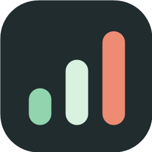
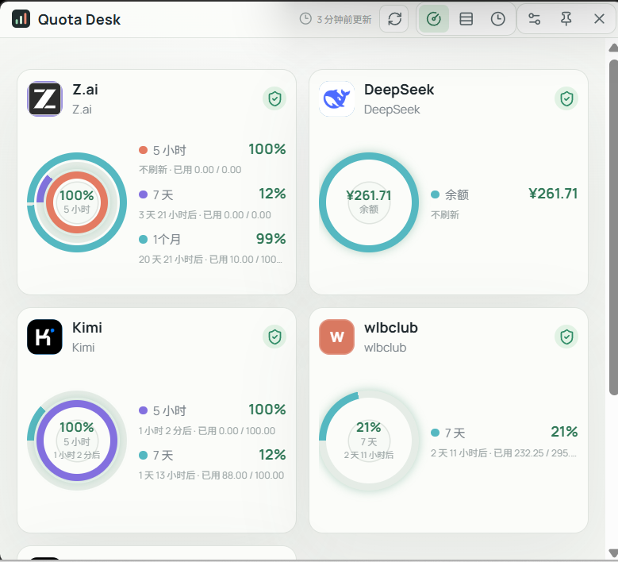
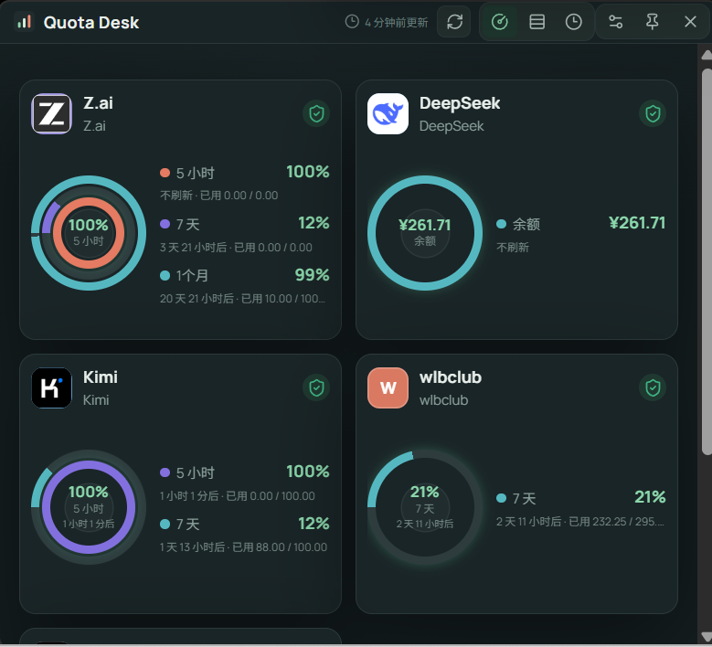
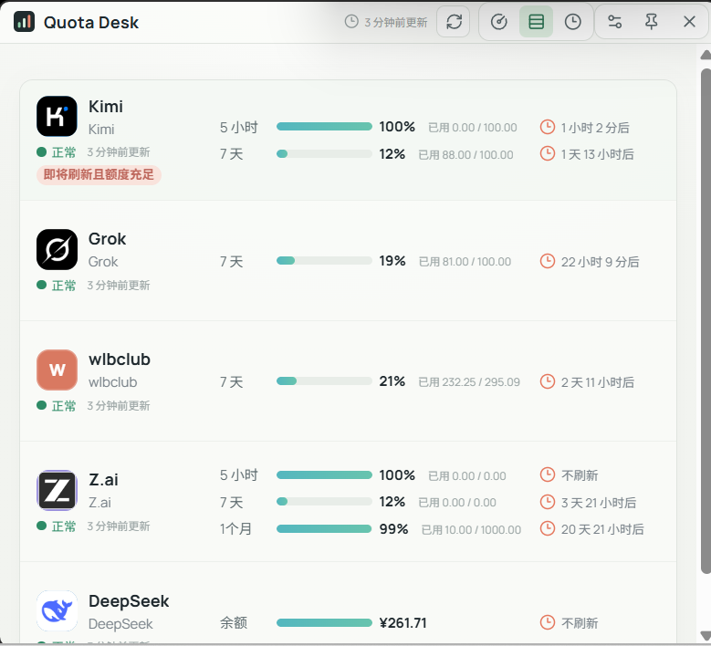
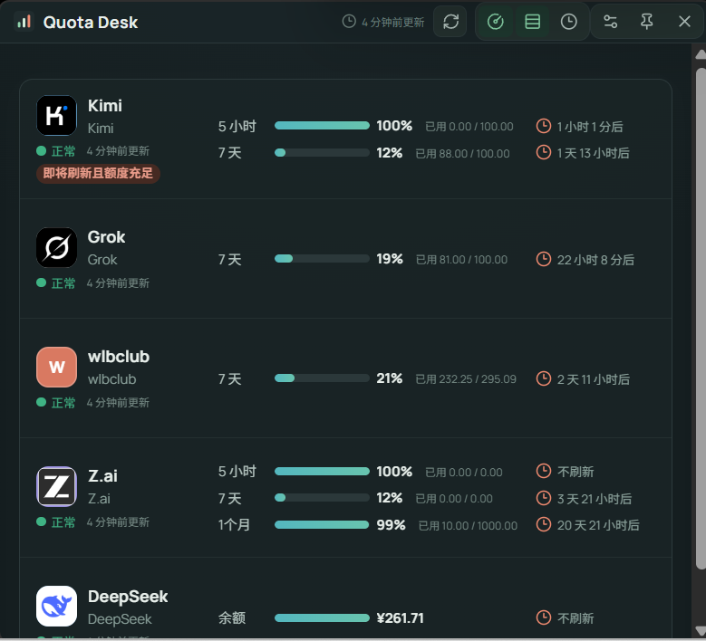
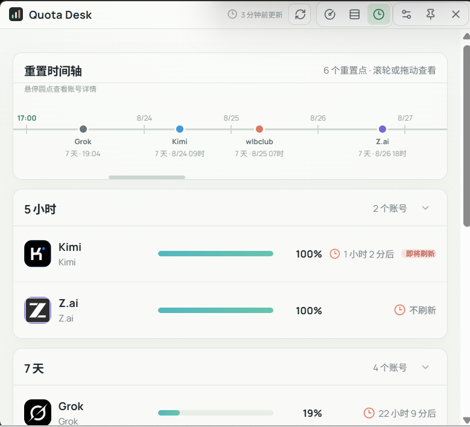
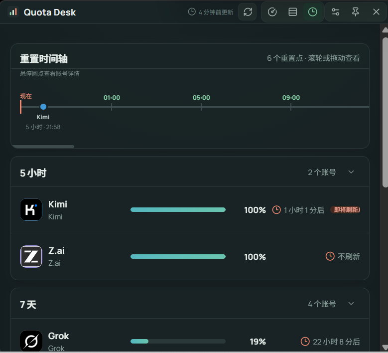
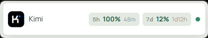
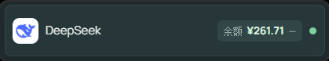

# Quota Desk



**把多个 Coding Plan 的额度放在一个桌面窗口里，及时发现即将刷新的剩余额度，减少周期性浪费。**

[](https://github.com/AloneAtWar/QuateDesk/releases)
[](LICENSE)

## 为什么需要 Quota Desk

当你同时订阅 Kimi、Z.ai、Claude、Codex、Gemini 或其他 Coding Plan 时，每个账号通常都有自己的额度周期：5 小时、7 天、1 个月，甚至按模型区分的额度桶。它们的刷新时间由订阅时间和首次使用时间决定，几乎不会完全同步。

这会带来一个很容易忽略的问题：某个周期快结束时，额度还剩很多，但你没有及时看到；周期刷新后，未使用额度被清零。几次周额度没有用满，也会进一步影响月度额度的实际利用率。切换工具可以帮助选择服务商，但它们通常不是为“集中观察额度、提醒即将浪费”设计的。

Quota Desk 专注解决这件事：把多个服务商、多个账号、多个周期集中到一个本地桌面应用里，用统一的视图查看剩余量、刷新倒计时和需要优先使用的账号。

## 核心功能

- **账号总览**：每个账号一张卡片，每个额度窗口用同心圆展示，剩余比例和刷新时间一眼可见。
- **行式明细**：按账号列出所有窗口，方便比较不同服务商的剩余量、已用量和刷新倒计时。
- **周期明细**：按 5 小时、7 天、1 个月等周期分组，并提供重置时间轴，快速找到最近要刷新的额度。
- **桌面浮窗**：像网速浮窗一样常驻桌面顶层，额度信息持续滚动；鼠标滚轮切换账号，双击展开主窗口，支持 80%–300% 等比缩放。
- **防浪费提醒**：自定义“刷新前多少分钟”和“至少剩余多少百分比”，命中时标记窗口并发送桌面通知。
- **亮色 / 暗色主题**：主窗口与桌面浮窗同步切换，下面的截图会固定展示两种主题。
- **多账号聚合**：同一服务商可以添加多个账号、标签和不同额度窗口，统一轮询更新。
- **cc-switch 导入**：扫描本机 cc-switch 数据，导入可识别的账号和 API Key；重复 Key 自动去重。
- **自定义服务商**：支持标准响应映射，也支持带变量的高级脚本；内置 New API 站点模板，填写站点信息即可接入兼容中转站。
- **自动更新与开机自启**：从 GitHub Releases 检查更新，也可以让应用随系统登录启动。

## 界面截图

每个视图都同时展示亮色和暗色版本。点击图片可以打开原图查看细节。

### 同心圆账号总览

<table>
  <tr>
    <td align="center"><strong>亮色</strong><br><a href="docs/screenshot/ScreenShot_2026-08-22_205516_430.png"></a></td>
    <td align="center"><strong>暗色</strong><br><a href="docs/screenshot/ScreenShot_2026-08-22_205617_590.png"></a></td>
  </tr>
</table>

### 行式明细

<table>
  <tr>
    <td align="center"><strong>亮色</strong><br><a href="docs/screenshot/ScreenShot_2026-08-22_205532_899.png"></a></td>
    <td align="center"><strong>暗色</strong><br><a href="docs/screenshot/ScreenShot_2026-08-22_205624_871.png"></a></td>
  </tr>
</table>

### 周期明细与重置时间轴

<table>
  <tr>
    <td align="center"><strong>亮色</strong><br><a href="docs/screenshot/ScreenShot_2026-08-22_205544_888.png"></a></td>
    <td align="center"><strong>暗色</strong><br><a href="docs/screenshot/ScreenShot_2026-08-22_205632_968.png"></a></td>
  </tr>
</table>

### 桌面浮窗

<table>
  <tr>
    <td align="center"><strong>亮色</strong><br><a href="docs/screenshot/ScreenShot_2026-08-22_205602_960.png"></a></td>
    <td align="center"><strong>暗色</strong><br><a href="docs/screenshot/ScreenShot_2026-08-22_205639_325.png"></a></td>
  </tr>
</table>

## 支持的服务商与额度来源

| 服务商 | 额度窗口 | 连接方式 |
| --- | --- | --- |
| Kimi for Coding | 5 小时、7 天 | API Token |
| Z.ai / 智谱 | 5 小时、7 天、1 个月 | API Token |
| DeepSeek | 余额 | API Token |
| wlbclub | 7 天 | API Token |
| Grok / SuperGrok | 自动识别周期窗口 | 读取本机 grok CLI 登录状态 |
| MiniMax Coding Plan | 5 小时、7 天 | API Token |
| Claude Code | 5 小时、7 天 | 读取本机 Claude Code 登录状态 |
| OpenAI Codex | 5 小时、7 天、1 个月 | 读取本机 Codex CLI 的 ChatGPT OAuth 登录状态 |
| Gemini CLI | Gemini Pro、Flash、Flash Lite | 读取本机 Gemini CLI 登录状态 |
| New API 兼容站点 | 按站点接口配置 | 自定义服务商中的 New API 模板 |

Claude、Codex、Gemini 和 Grok 不需要在 Quota Desk 中重复填写 Token，但使用前需要先在对应 CLI 中完成登录。New API 是兼容站点模板，不限定某一个中转站域名。

## 快速开始

1. 从 [Releases](https://github.com/AloneAtWar/QuateDesk/releases) 下载对应平台的安装包。
2. 打开 Quota Desk，在设置中添加账号。API 服务商填写 API Token；CLI 服务商先完成对应 CLI 登录。
3. 保存后应用会立即测试账号并开始轮询。根据自己的使用习惯设置轮询间隔和提醒规则。
4. 打开桌面浮窗，让额度信息持续显示在桌面上；需要集中查看时切换到总览、行式明细或周期明细。

### 从 cc-switch 导入

在设置中点击“从 cc-switch 导入账号”。应用会读取本机 `~/.cc-switch/cc-switch.db`，列出可以匹配到 Quota Desk 服务商的账号供选择。导入过程只迁移 API Key，凭据会由 Quota Desk 重新加密保存；重复的 Key 不会重复导入，cc-switch 中无法匹配的自定义服务商需要手动配置。

## 下载与平台

每个版本的 Release 会提供：

- **Windows**：NSIS 安装版和便携版。
- **macOS**：Intel（x64）与 Apple Silicon（arm64）的 DMG / ZIP。
- **Linux**：AppImage。

## 隐私与数据

- Quota Desk 没有云端账号和后端服务，额度请求由本机直接发送到对应服务商接口。
- API Token 和脚本中的敏感变量使用 Electron `safeStorage` 加密后保存在本机；Windows 使用系统 DPAPI。
- 普通配置和加密凭据都保存在应用数据目录下：
  - Windows：`%APPDATA%\Quota Desk\state.json` 和 `%APPDATA%\Quota Desk\credentials.json`
  - macOS：`~/Library/Application Support/Quota Desk/state.json` 和 `~/Library/Application Support/Quota Desk/credentials.json`
  - Linux：`~/.config/Quota Desk/state.json` 和 `~/.config/Quota Desk/credentials.json`

## 开发

```bash
npm install
npm test            # 运行轮询器和额度解析测试
npm run dev         # 启动 Vite 网页开发模式
npm run desktop     # 构建并启动 Electron 桌面应用
npm run dist:win    # 构建 Windows 安装版和便携版
npm run dist:mac    # 构建 macOS 安装包
npm run dist:linux  # 构建 Linux AppImage
```

项目使用 Electron、React 和 Vite 构建，额度数据只在本机处理。

## License

[MIT](LICENSE)
