# Quota Desk

<p align="center"><strong>别让 Coding Plan 的额度悄悄溜走</strong></p>

<p align="center">
  <a href="https://github.com/AloneAtWar/QuateDesk/releases"></a>
  <a href="https://github.com/AloneAtWar/QuateDesk/releases"></a>
  <a href="LICENSE"></a>
</p>

<p align="center">
  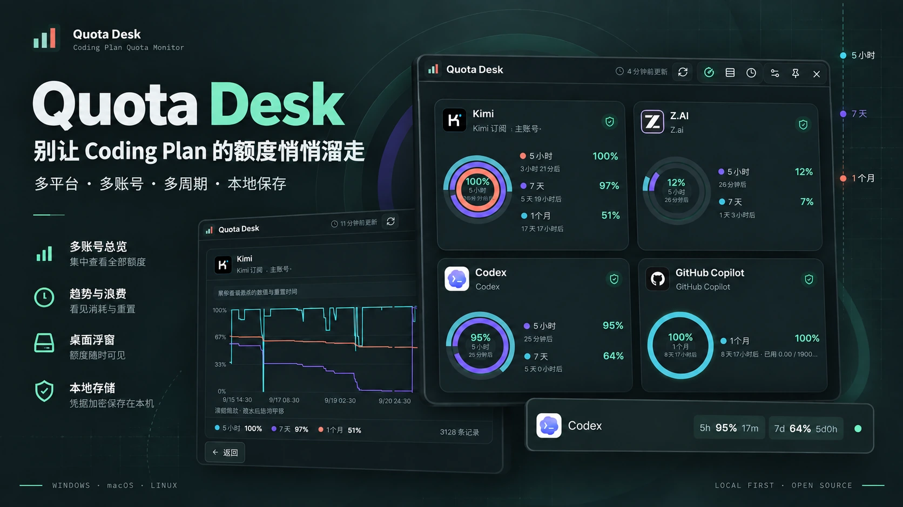
</p>

<p align="center">
  <a href="https://github.com/AloneAtWar/QuateDesk/releases"><strong>下载最新版本</strong></a>
  ·
  <a href="CHANGELOG.md">查看更新记录</a>
</p>

Quota Desk 是一个本地桌面额度监控工具。它把不同 Coding Plan、不同账号和不同额度周期集中到同一个窗口，持续展示剩余额度、重置倒计时、使用趋势与周期浪费。

当 5 小时、1 天、7 天、1 个月、1 年等额度在不同时间刷新时，你可以提前知道哪些额度即将重置，并决定接下来优先使用哪个账号。

## 为什么需要 Quota Desk

同时订阅多个 Coding Plan 后，每个账号的额度周期通常不会同步。某个周期快结束时仍剩下很多额度，如果没有及时注意，刷新后便会直接进入下一个周期。

Quota Desk 专门处理这件事：

- 把多个服务商和多个账号放到一个视图中。
- 同时观察短周期、周周期、月周期和余额型额度。
- 记录额度变化，区分真实趋势与关机造成的数据空档。
- 归档周期结束时的剩余额度，长期观察实际浪费情况。
- 用桌面浮窗和系统通知把即将刷新的额度保持在视线内。

## 从剩余额度到使用洞察

<p align="center">
  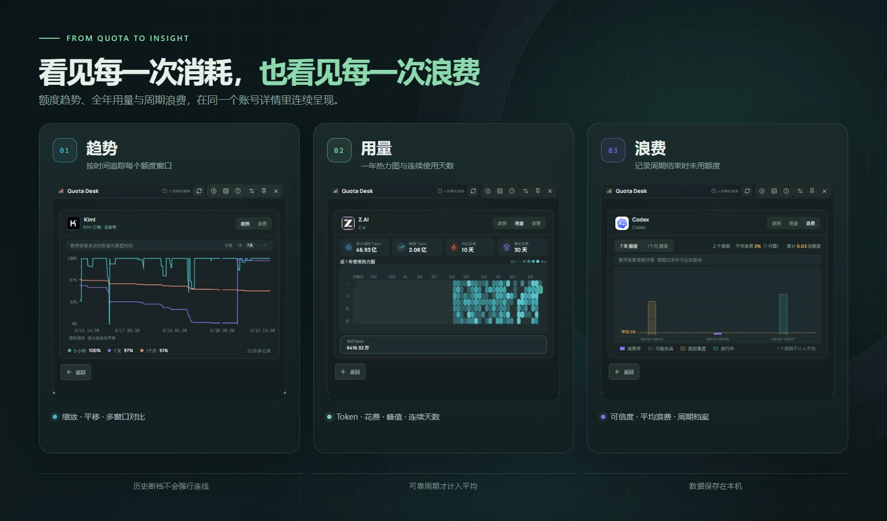
</p>

### 额度趋势

每次成功刷新都会记录额度快照。趋势图支持时间范围切换、滚轮缩放、拖动平移和多窗口显隐；程序关闭或查询失败造成的数据空档不会被强行连线。

### 官方用量

DeepSeek、Z.ai、Codex 和 MiniMax 支持逐日用量视图，包括近一年热力图、累计消耗、峰值日、当前连续天数和最长连续天数。各厂商能够提供的统计维度可能不同。

### 周期浪费

固定周期结束时，Quota Desk 会归档当时未使用的额度。浪费视图提供周期柱状图、平均浪费率、累计浪费和可信度标记；长时间关机或厂商提前重置造成的不可靠周期不会计入平均。

## 核心功能

| 功能 | 能做什么 |
| --- | --- |
| 多账号总览 | 每个账号一张卡片，用同心圆同时展示多个额度窗口；卡片支持拖动排序 |
| 行式与周期明细 | 横向比较账号，或按 5 小时、1 天、7 天、1 个月、1 年等周期分组 |
| 重置时间轴 | 把即将到来的重置点放到同一条时间轴上；悬停倒计时可看具体时间点 |
| 优先级排序 | 分别调整短周期和长周期中“剩余额度 / 距重置时间”的权重 |
| 桌面浮窗 | 常驻桌面顶层，滚轮切换账号，双击打开主窗口，支持大小与长度调节 |
| 防浪费提醒 | 按“刷新前多少分钟”和“至少剩余多少”发送桌面通知 |
| 历史、用量与浪费 | 从实时额度继续追踪趋势、官方逐日用量和周期浪费 |
| 多账号登录快照 | 独立保存多个 CLI / OAuth 登录，不受当前激活账号切换影响 |
| 账号停用 | 停止巡检但保留凭据、历史和浪费档案，之后可以继续启用 |
| 自定义服务商 | 标准字段映射、高级脚本和 New API 兼容站点模板 |
| 网络与可靠性 | 支持系统代理、手动代理、直连、账号级超时和瞬时错误重试 |
| 桌面集成 | 亮色 / 暗色主题、系统托盘、开机启动和自动更新 |

## 多种账号，一个入口

<p align="center">
  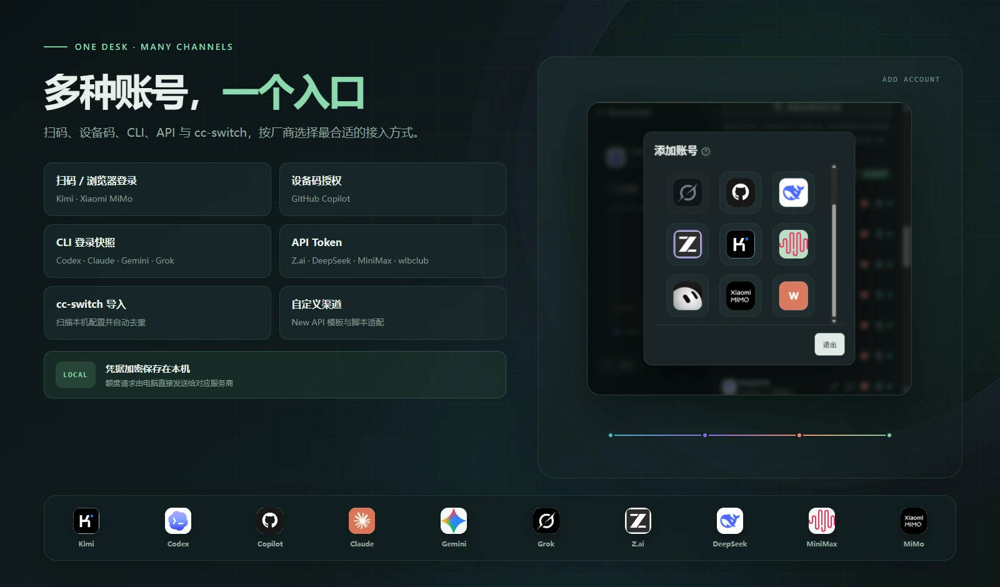
</p>

添加账号时先选择厂商，再进入对应的登录方式。订阅渠道、CLI 登录和 API / 中转账号使用同一个入口；凭据过期后，支持的渠道可以直接重新扫码、重新授权或重新导入。

## 支持的服务商

| 服务商 | 主要额度 | 接入方式 |
| --- | --- | --- |
| Kimi for Coding | 5 小时、7 天、1 个月 | 手机扫码登录 Kimi 订阅 |
| Z.ai / 智谱 | 5 小时、7 天、1 个月 | API Token |
| DeepSeek | API 余额 | API Token；用量页使用浏览器登录 |
| wlbclub | 1 天、7 天 | API Token |
| Grok | 7 天 | 导入本机 Grok CLI 登录 |
| Grok Bot | 7 天 | 导入本机 Grok Bot 客户端登录 |
| MiniMax Coding Plan | 5 小时、7 天 | API Token；用量页使用浏览器登录 |
| Xiaomi MiMo Token Plan | 1 个月或 1 年 Credits | 浏览器登录小米账号 |
| Claude Code | 5 小时、7 天 | 导入本机 Claude Code 登录 |
| OpenAI Codex | 5 小时、7 天、1 个月 | 导入本机 Codex CLI 登录 |
| Gemini CLI | Gemini Pro、Flash、Flash Lite | 导入本机 Gemini CLI 登录 |
| GitHub Copilot | 每月 Premium requests | GitHub 设备码授权 |
| New API 兼容站点 | 由站点接口决定 | 自定义服务商中的 New API 模板 |

CLI 和 OAuth 渠道可以保存多个独立账号快照。支持刷新令牌的渠道会在令牌临期或失效时自动续期；同一登录会按账号指纹去重。

### 从 cc-switch 导入

Quota Desk 可以读取本机 `~/.cc-switch/cc-switch.db`，列出能够识别的账号供选择。API Key 和可识别的官方 OAuth 登录会重新加密保存；重复凭据不会重复导入。

### 数据导入与导出

在“设置 → 数据导入与导出”中可保存和恢复 Quota Desk 数据。备份包含账号、自定义厂商（同一厂商只保存一次）、账号凭据、本地额度历史和周期浪费档案。导入会先显示新增与重复项目数量，再与当前数据合并；已有账号和厂商配置优先保留，重复历史记录不会再添加。

导出文件是未加密的 JSON，包含 API Token、登录快照和网页会话等敏感凭据。请存放在受保护的位置，迁移完成后按需删除临时副本。导入后凭据会重新使用当前系统的 `safeStorage` 加密保存。厂商服务端的逐日用量按需重新查询，不属于本地备份。

## 三步开始使用

1. 从 [Releases](https://github.com/AloneAtWar/QuateDesk/releases) 下载对应平台的安装包。
2. 打开“添加账号”，选择厂商并按照提示扫码、授权、导入 CLI 登录或填写 API Token。
3. 设置轮询间隔与提醒规则，然后开启桌面浮窗。

## 桌面浮窗与双主题

浮窗会根据可用宽度逐步收起标签和倒计时，支持 80%–300% 等比缩放以及 60%–150% 长度调节。主窗口切换主题时，浮窗会同步更新。

<table>
  <tr>
    <td align="center"><strong>亮色</strong><br>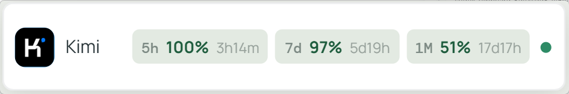</td>
    <td align="center"><strong>暗色</strong><br>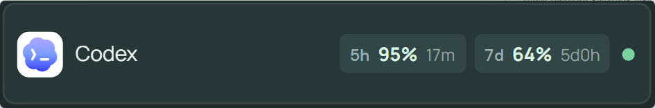</td>
  </tr>
</table>

## 隐私与本地存储

- Quota Desk 没有云端账号和后端服务，额度请求由电脑直接发送到对应服务商。
- API Token、OAuth 登录快照和网页会话等敏感凭据使用 Electron `safeStorage` 加密后保存在本机；Windows 使用系统 DPAPI。
- 普通设置、加密凭据、额度历史和周期档案都保存在应用数据目录中。
- 删除账号会同时删除该账号的凭据与历史；停用账号则完整保留数据。

默认数据目录：

| 平台 | 目录 |
| --- | --- |
| Windows | `%APPDATA%\Quota Desk\` |
| macOS | `~/Library/Application Support/Quota Desk/` |
| Linux | `~/.config/Quota Desk/` |

## 完整界面截图

<details>
  <summary>展开查看账号总览、周期明细、趋势、用量、浪费和添加账号</summary>
  <br>
  <table>
    <tr>
      <td align="center"><strong>账号总览</strong><br>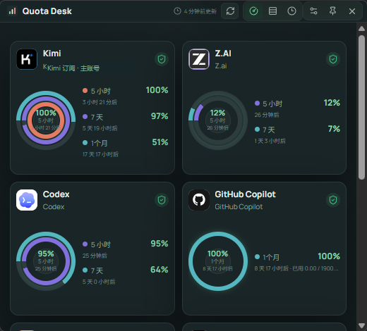</td>
      <td align="center"><strong>周期明细与重置时间轴</strong><br>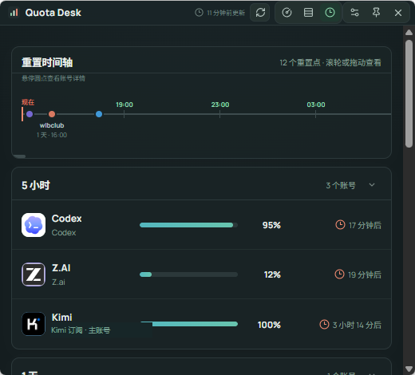</td>
    </tr>
    <tr>
      <td align="center"><strong>额度趋势</strong><br>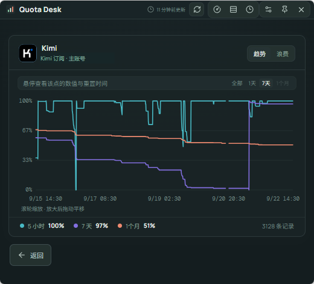</td>
      <td align="center"><strong>全年用量</strong><br>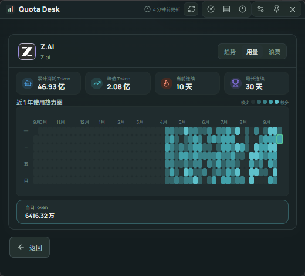</td>
    </tr>
    <tr>
      <td align="center"><strong>周期浪费</strong><br>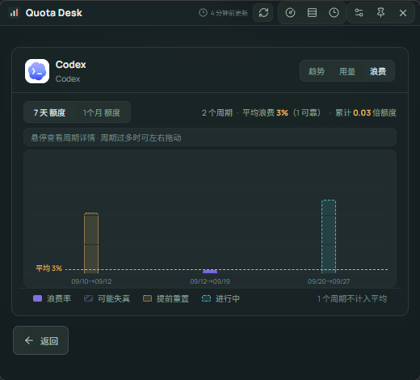</td>
      <td align="center"><strong>添加账号</strong><br>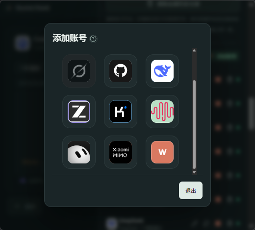</td>
    </tr>
  </table>
</details>

## 下载与平台

每个版本的 Release 提供：

- **Windows**：NSIS 安装版和便携版。
- **macOS**：Intel（x64）与 Apple Silicon（arm64）的 DMG / ZIP。
- **Linux**：AppImage。

应用可以定时检查 GitHub Releases。当前安装形式不支持应用内更新时，会打开发布页供手动下载。

## 自定义服务商

除了内置渠道，还可以通过以下方式接入其他额度接口：

- **标准映射**：配置请求地址、认证方式和响应字段路径。
- **New API 模板**：填写站点地址、`accessToken` 和 `userId`。
- **高级脚本**：自定义请求方法、请求头、请求体、变量和响应解析逻辑。

添加或编辑账号时可以先测试连接，再决定是否保存。

## 开发

```bash
npm install
npm test
npm run dev
npm run desktop
```

生成安装包：

```bash
npm run dist:win
npm run dist:mac
npm run dist:linux
```

项目使用 Electron、React 和 Vite 构建，额度数据只在本机处理。

## 支持项目

如果 Quota Desk 对你有帮助，可以请我喝杯咖啡。感谢你的支持。

<details>
  <summary>☕ 展开微信收款码</summary>
  <br>
  <p align="center">
    <a href="docs/readme/wechat-pay.jpg"></a>
  </p>
  <p align="center"><sub>使用微信扫码，或点击图片查看原图</sub></p>
</details>

## License

[MIT](LICENSE)
