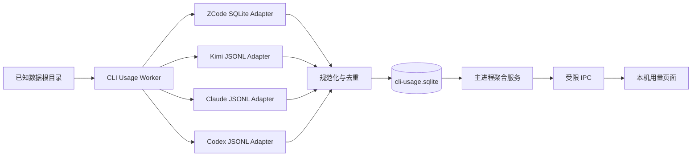
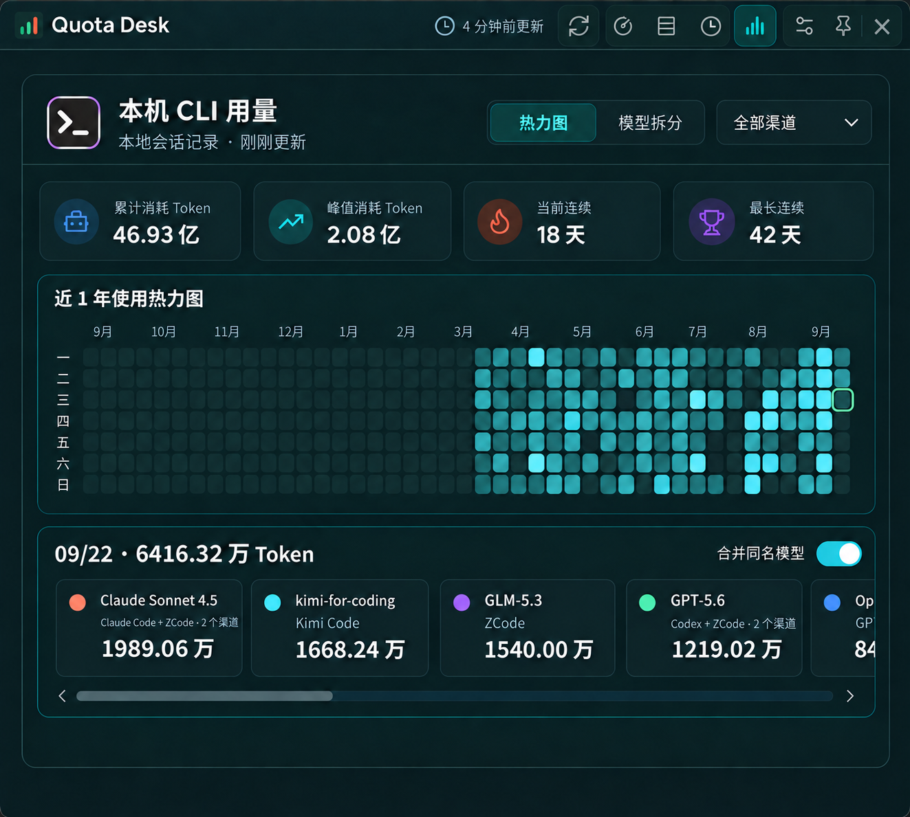
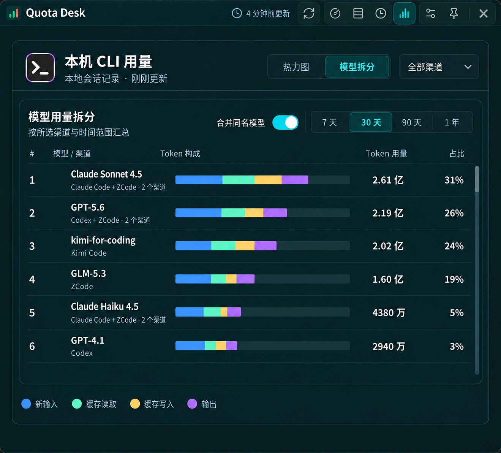

# Quota Desk 本机 CLI 用量聚合方案

> 调研日期：2026-09-23  
> 目标平台：ZCode、Kimi Code、Claude Code、OpenAI Codex  
> 结论：建议新增独立的全局“本机用量”视图，直接只读解析本机会话数据，不把本地统计混入现有账号额度或官方用量。

## 1. 决策摘要

### 产品决策

1. 在标题栏现有“账号总览 / 行式明细 / 周期明细”视图切换旁增加第四个全局入口，名称为 **本机用量**，图标采用与现有控件一致的用量/柱形图语义。
2. 页面默认展示 **近一年热力图**，沿用现有官方用量页的阅读方式；点击某一天后，下方联动展示当天的模型构成。
3. 页面顶部使用一个 **单选渠道下拉框**，默认只显示“全部渠道”；选择 ZCode、Kimi Code、Claude Code 或 Codex 后查看对应 CLI。未来渠道增多时页面宽度不变。
4. 页头右侧先放 **热力图 / 模型拆分**，再把“全部渠道”下拉框放在最右侧；二者分别控制展示方式和数据范围。
5. 热力图沿用现有官方用量页的四项指标；模型拆分不显示统计卡，把纵向空间完整留给可滚动模型列表。
6. 在热力图的当日模型区和模型拆分页都提供 **合并同名模型** 开关，默认开启且共用同一状态；关闭后才按 CLI 分行。
7. 现有账号详情中的“用量”应改名为 **官方用量**。新页面只展示 CLI 本地记录，防止用户把“订阅额度”“厂商官方统计”“本地日志统计”当成同一口径。
8. 第一版不把本地记录归属到 Quota Desk 中的具体账号。本地日志通常没有稳定、可验证的账号标识，错误归属比不归属更危险。

### 技术决策

1. 在 Electron 主进程中增加一个 Worker 和四个内置适配器，不要求用户安装 `ccusage`，不在运行时下载第三方程序。
2. ZCode 使用 Electron 43 自带 Node 24 的 `node:sqlite` 以只读方式查询；Kimi Code、Claude Code、Codex 采用流式 JSONL 解析。
3. 规范化事件只保存时间、来源、模型、会话哈希和 Token 数字；不保存消息正文、代码、命令输出或完整项目路径。
4. 单独使用 `cli-usage.sqlite` 做增量索引和聚合，避免扩大现有 `history.json`，也避免每次打开页面全量重扫。
5. 默认指标是 Token；金额只能作为后续的“API 等价估算”，必须带估算标识和定价覆盖率，不能冒充订阅账单。

## 2. 为什么要与现有用量分开

当前项目已有三类数据：

| 数据 | 当前实现 | 语义 |
| --- | --- | --- |
| 账号额度 | `electron/cli-quota.cjs`、轮询历史 | 5 小时、7 天、月度等剩余额度和重置时间 |
| 官方用量 | `electron/provider-usage.cjs`、`ProviderUsageView` | 厂商返回的逐日 Token、金额或活动统计 |
| 周期浪费 | `electron/waste.cjs` | 周期结束前未使用的额度 |

本次功能增加的是第四类：**本机 CLI 会话消耗**。它回答“这台电脑上的哪些 CLI、模型和会话消耗了多少 Token”，与“账号还剩多少比例”是不同问题。

必须保持以下边界：

- Z.ai 官方逐日统计与 ZCode 本地数据库可能覆盖同一批请求，不能相加。
- Codex 官方 profile 与 Codex rollout 也可能重叠，不能相加。
- 本地记录只代表当前机器及已配置的数据根目录，不代表账号在网页、其他电脑或远程机器上的全部使用。
- Windows 下默认连同 WSL 运行中发行版的同名数据目录一起统计（`\\wsl$\<distro>` 只读访问，SQLite 源复制副本到本地临时目录后打开），可在设置“本机用量”中关闭。
- Token 与额度百分比没有稳定换算关系。本地 Token 不能用来推算 5 小时或 7 天额度。

## 3. 开源项目怎么做

### 3.1 ccusage

[ccusage](https://github.com/ccusage/ccusage) 已把 Claude Code、Codex、Kimi 和 ZCode 纳入同一个 daily / weekly / monthly / session 报告模型，并支持 `--by-agent` 聚合。它证明“四个平台统一为同一组 Token 字段”是可行的，但其 Codex 和 Kimi 适配仍明确标为 Beta / Experimental。

可借鉴的部分：

- 每个平台独立发现数据源，再统一输出 daily、monthly、session。
- 支持多个数据根目录，适应不同 profile 和归档目录。
- Codex 同时扫描 `sessions` 与 `archived_sessions`，活动目录优先，防止归档副本重复。
- Kimi Code 只统计 `usageScope: "turn"`，忽略累计的 session 记录。
- JSON 输出保留 `inputTokens`、`outputTokens`、`cacheCreationTokens`、`cacheReadTokens` 和模型拆分。

参考：[ccusage 支持来源与统一命令](https://github.com/ccusage/ccusage/blob/main/apps/ccusage/README.md)、[Codex 数据源](https://github.com/ccusage/ccusage/blob/main/docs/guide/codex/index.md)、[Kimi 数据源](https://github.com/ccusage/ccusage/blob/main/docs/guide/kimi/index.md)。

### 3.2 CodeBurn

[CodeBurn](https://github.com/getagentseal/codeburn) 的价值在于把每个平台的路径、格式、去重和异常写得很清楚：

- ZCode 读取 `~/.zcode/cli/db/db.sqlite` 的 `session`、`model_usage`、`tool_usage`，不读缺少 Token 的活动日志。
- ZCode 的 `input_tokens` 包含缓存读写，必须先减去缓存桶，才能得到“新输入”。
- Claude Code 的流式响应会重复写相同消息 ID，必须全局去重。
- Codex 的 `token_count` 同时有单次 `last_token_usage` 和累计 `total_token_usage`，并存在重复事件、分支和子 Agent 历史回放。

参考：[ZCode 适配说明](https://github.com/getagentseal/codeburn/blob/main/docs/providers/zcode.md)、[Claude 适配说明](https://github.com/getagentseal/codeburn/blob/main/docs/providers/claude.md)、[Codex 适配说明](https://github.com/getagentseal/codeburn/blob/main/docs/providers/codex.md)。

### 3.3 Kimi Builders Usage

[Kimi Builders Usage](https://github.com/kimi-builders/usage) 把“本地 Token 看板”“订阅额度”“可选同步”划成独立能力，并在 UI 中明确费用只是标准 API 价格估算。这个边界适合 Quota Desk：本地扫描默认不应触发供应商网络请求，也不应与账号额度合并。

### 3.4 采用方式

不建议直接执行 `npx ccusage`：

- 会把 Node/npm、网络可用性和第三方包版本变成 Quota Desk 的运行时依赖。
- 打包 Rust/平台二进制会扩大安装包和发布矩阵。
- Quota Desk 只需要四个适配器和现有 UI 所需的固定数据契约。

建议根据公开格式与测试用例实现小型内部适配层。若直接移植 MIT 项目的代码，应保留许可证与来源说明；更稳妥的做法是按本文数据契约独立实现，并使用自建 fixture 验证。

## 4. 四个平台的解析方案

本机对当前版本做过一次只读结构核验，只检查表结构和 JSON 字段名，没有输出会话正文、项目路径、账号或凭据。当前四类数据源均存在，字段与下表所列开源实现一致。

| 平台 | 数据发现 | 权威记录 | 解析字段 | 去重键 | 稳定性 |
| --- | --- | --- | --- | --- | --- |
| ZCode | 设置覆盖 > `ZCODE_HOME` > `~/.zcode` | `cli/db/db.sqlite` | `model_usage.id/session_id/model_id/started_at/completed_at/input_tokens/output_tokens/reasoning_tokens/cache_*`，关联 `session.directory/version` | `zcode:<root-id>:<model_usage.id>` | 高；SQLite schema 仍需版本探测 |
| Kimi Code | 设置覆盖 > `KIMI_CODE_HOME` > `~/.kimi-code`，兼容 `~/.kimi` | 新版 `sessions/**/agents/*/wire.jsonl` 的 `usage.record`；旧版 `wire.jsonl` 的 `StatusUpdate` | `model`、`time`、`usage.inputOther/output/inputCacheRead/inputCacheCreation` | `kimi:<root-id>:<relative-file>:<line-byte-offset>` | 中；新版格式仍在演进 |
| Claude Code | 设置覆盖 > `CLAUDE_CONFIG_DIRS` > `CLAUDE_CONFIG_DIR` > `~/.claude`，兼容 `~/.config/claude` | `projects/<project>/<session>.jsonl` 的 assistant message | `timestamp/sessionId/version/message.id/message.model/message.usage.input_tokens/output_tokens/cache_*` | 全局 `message.id`，同 ID 取最终或各字段最大值；`requestId` 仅作辅助 | 中高；流式重复是主要风险 |
| Codex | 设置覆盖 > `CODEX_HOME` > `~/.codex` | `sessions/YYYY/MM/DD/rollout-*.jsonl` 与 `archived_sessions/*.jsonl` | `session_meta`、`turn_context.payload.model`、`event_msg.payload.type=token_count` 的 last/total usage | 逻辑线程 + 累计 Token 指纹；活动/归档同路径副本只取活动文件 | 中；分支与 MultiAgent 回放最复杂 |

### 4.1 ZCode

查询方式：

```sql
SELECT
  mu.id,
  mu.session_id,
  mu.model_id,
  mu.provider_id,
  mu.started_at,
  mu.completed_at,
  mu.input_tokens,
  mu.output_tokens,
  mu.reasoning_tokens,
  mu.cache_creation_input_tokens,
  mu.cache_read_input_tokens,
  mu.computed_total_tokens,
  s.directory,
  s.version
FROM model_usage mu
LEFT JOIN session s ON s.id = mu.session_id
WHERE MAX(mu.started_at, COALESCE(mu.completed_at, 0)) >= ?
ORDER BY mu.started_at, mu.id;
```

实现要点：

- `DatabaseSync(path, { readOnly: true })`，连接后执行 `PRAGMA query_only = ON` 和短 `busy_timeout`。
- ZCode 使用 WAL。不要复制单个 `db.sqlite` 后再读，也不要使用忽略 WAL 的 immutable 模式，否则会漏掉尚在 WAL 中的最新记录。
- 每次回看最近 7 天并按 `model_usage.id` UPSERT，以覆盖先创建、后补齐 `completed_at` 和 Token 的请求。
- `freshInput = max(0, input_tokens - cache_read - cache_creation)`。
- `reasoning_tokens` 作为输出子集展示，不计入总 Token，避免重复。
- 数据库、表或字段缺失时将该来源标记为“不兼容”，不能影响其他三个来源。

[CodeBurn 的 ZCode 文档](https://github.com/getagentseal/codeburn/blob/main/docs/providers/zcode.md) 给出了相同表结构与缓存包含关系；[ZCode 官方仓库](https://github.com/zai-org/ZCode) 可用于跟踪格式变化。

### 4.2 Kimi Code

新版记录示意：

```json
{
  "type": "usage.record",
  "model": "kimi-code/kimi-for-coding",
  "usage": {
    "inputOther": 3064,
    "output": 76,
    "inputCacheRead": 14848,
    "inputCacheCreation": 0
  },
  "usageScope": "turn",
  "time": 1782113184943
}
```

实现要点：

- 扫描 `~/.kimi-code/sessions/<workDirKey>/<sessionId>/agents/<agentId>/wire.jsonl`；官方目录结构见 [Kimi Code 会话文档](https://www.kimi.com/code/docs/en/kimi-code-cli/guides/sessions.html)。
- 只统计 `usageScope === "turn"`；`session` 是累计值，加入会造成重复。
- 同时解析所有 agent 目录，主 Agent 和子 Agent 都属于真实消耗。
- 兼容旧版 `~/.kimi/sessions/**/wire.jsonl` 中 `StatusUpdate.token_usage` 的 snake_case 字段。
- 事件没有稳定 ID，使用“根目录 ID + 相对文件 + 行起始字节偏移”做物理事件键。文件被截断或替换时重扫并 UPSERT。
- 模型名去掉展示上的 `kimi-code/` 前缀可以更简洁，数据库仍保存原始值以便诊断。

### 4.3 Claude Code

只处理 `type === "assistant"` 且 `message.usage` 有效的行，提取：

```text
timestamp
sessionId
version
isSidechain
requestId（可能缺失）
message.id
message.model
message.usage.input_tokens
message.usage.output_tokens
message.usage.cache_read_input_tokens
message.usage.cache_creation_input_tokens
message.usage.cache_creation.ephemeral_5m_input_tokens（可选）
message.usage.cache_creation.ephemeral_1h_input_tokens（可选）
```

实现要点：

- 同一个逻辑响应会因流式 content block 重复写多行，并可能在恢复会话后再次出现。
- 不能“第一条胜出”。应按全局 `message.id` 分组，保留时间更晚且总用量更大的最终快照；为防个别字段分别增长，合并时对四个 Token 字段取最大值。
- `requestId` 存在时用来校验冲突，不能成为必须条件。已有项目曾因 requestId 缺失而重复计数，也曾因保留第一条中间快照而严重少计。
- `isSidechain: true` 代表子 Agent，应该计入总量；第一版可以不单独显示，数据库保留布尔值供以后拆分。

相关案例：[ccusage 流式重复导致多计](https://github.com/ccusage/ccusage/issues/994)、[保留第一条快照导致少计](https://github.com/ccusage/ccusage/issues/888)。

### 4.4 Codex

处理三种事件：

1. `session_meta`：取得 session/thread ID、cwd、CLI 版本和来源。
2. `turn_context`：更新后续 Token 事件所对应的模型。
3. `event_msg` 且 `payload.type === "token_count"`：读取 `last_token_usage` 与 `total_token_usage`。

Token 语义：

- `last_token_usage` 是最近一次请求的增量，存在时优先使用。
- 只有累计值时，用本次 `total_token_usage` 减前一次累计值。
- `cached_input_tokens` 和 `cache_write_input_tokens` 包含在 input 中，规范化时从新输入中扣除。
- `reasoning_output_tokens` 是 output 的子集，只做信息展示。

去重顺序：

1. 相邻 `info` 完全相同则跳过。
2. 累计 Token 元组没有前进则跳过。
3. 活动与归档目录出现同一相对 rollout 时只选活动文件。
4. 分支或子 Agent rollout 带父历史前缀时，以最后一个继承累计快照作为基线，只统计随后增长；逻辑键优先使用父线程/派生线程标识。

如果日志缺少模型元数据，保留 Token、把模型标为“未知”；不要为了估价强行猜成某个 GPT 模型。Codex 官方仓库中的 rollout 使用 `sessions` / `archived_sessions` 目录，[ccusage Codex 文档](https://github.com/ccusage/ccusage/blob/main/docs/guide/codex/index.md) 也记录了当前 MultiAgent 回放处理。

## 5. 统一数据契约

### 5.1 规范化事件

```ts
type LocalCliAgentId = string; // 稳定小写 ID，例如 zcode、kimi；由 adapter registry 提供

type LocalCliUsageEvent = {
  eventKey: string;
  agent: LocalCliAgentId;
  occurredAtMs: number;
  sessionKey: string;       // HMAC/哈希后的稳定 ID
  projectKey: string | null; // 默认只存哈希；不传给 renderer
  model: string | null;
  inputTokens: number;      // 不含缓存的新输入
  cacheReadTokens: number;
  cacheWriteTokens: number;
  outputTokens: number;
  reasoningTokens: number;  // 信息子集，不重复加入 total
  extraTokens: number;      // 厂商总数与可分类字段的正差
  totalTokens: number;
  requestCount: 1;
  sourceVersion: string | null;
  exact: boolean;
};
```

统一公式：

```text
classified = input + cacheRead + cacheWrite + output
extra      = max(0, providerReportedTotal - classified)
total      = providerReportedTotal 可用时取它，否则 classified
reasoning  = output 的子集，只展示，不再相加
```

### 5.2 IPC 契约

热力图和模型列表的刷新频率不同：点击日期只需要查当天模型，切换周期只需要查模型排行。不要让 renderer 每次交互都重新获取整年数据。拆成四个受限 IPC：

```text
cliUsage:get-summary   近一年摘要与逐日热力图
cliUsage:get-models    指定日期或周期的模型聚合
cliUsage:get-sources   渠道元数据和扫描状态
cliUsage:scan          触发一次增量扫描
```

preload 只暴露对应的窄方法：`getLocalCliUsageSummary`、`getLocalCliUsageModels`、`getLocalCliUsageSources`、`scanLocalCliUsage`。renderer 不接收文件路径，也不能传任意 SQL、glob 或目录。

```ts
type LocalCliUsageSummaryQuery = {
  agent: 'all' | LocalCliAgentId;
  timezone: string;
  endDate?: string; // 缺省为该时区今天，返回向前 365 天
};

type LocalCliUsageSummaryReport = {
  range: { start: string; end: string; timezone: string };
  filter: LocalCliUsageSummaryQuery;
  summary: {
    totalTokens: number;
    peakTokens: number;
    currentStreakDays: number;
    longestStreakDays: number;
    inputTokens: number;
    cacheReadTokens: number;
    cacheWriteTokens: number;
    outputTokens: number;
    sessions: number;
    activeDays: number;
    cacheReuseRatio: number | null;
  };
  days: Array<{
    date: string;
    totalTokens: number;
    inputTokens: number;
    cacheReadTokens: number;
    cacheWriteTokens: number;
    outputTokens: number;
    sessions: number;
    agents: Record<string, number>;
  }>;
};

type LocalCliUsageModelsQuery = {
  agent: 'all' | LocalCliAgentId;
  mergeSameModels: boolean; // 仅 agent === 'all' 时生效；缺省按 true
  scope: { kind: 'range'; days: 7 | 30 | 90 | 365 }
    | { kind: 'day'; date: string };
  timezone: string;
};

type LocalCliUsageModelsReport = {
  range: { start: string; end: string; timezone: string };
  filter: LocalCliUsageModelsQuery & { effectiveMergeSameModels: boolean };
  models: Array<{
    modelKey: string;
    displayName: string;
    agents: LocalCliAgentId[];
    rawModels: string[];
    totalTokens: number;
    inputTokens: number;
    cacheReadTokens: number;
    cacheWriteTokens: number;
    outputTokens: number;
    extraTokens: number;
    sessions: number;
    requests: number;
    share: number;
  }>;
};

type LocalCliUsageSource = {
  agent: LocalCliAgentId;
  displayName: string;
  iconKey: string;
  colorToken: string;
  status: 'ready' | 'missing' | 'partial' | 'incompatible' | 'error';
  lastScannedAt: string | null;
  records: number;
  warning: string | null;
};
```

“全部渠道”的总数必须严格等于所有已启用渠道同区间结果之和。所有整数在主进程以安全整数校验，负数、NaN、Infinity 和超出安全整数的值均丢弃并记录 schema 告警。

## 6. 存储与扫描架构



### 6.1 新文件建议

```text
electron/
  cli-usage/
    index.cjs
    worker.cjs
    normalize.cjs
    paths.cjs
    store.cjs
    adapters/
      zcode.cjs
      kimi.cjs
      claude.cjs
      codex.cjs
src/
  local-cli-usage-format.js
  main.jsx                  # 新增 LocalCliUsageView
  styles.css                # 复用现有 provider usage 样式
tests/
  cli-usage-*.test.cjs
  fixtures/cli-usage/...
```

### 6.2 数据库

建议三张核心表：

- `source_files`：来源、规范化路径、mtime、size、字节游标、格式版本、扫描状态。
- `usage_events`：上面的规范化事件，不含正文。
- `scan_runs`：每次扫描耗时、成功数、跳过数和脱敏错误，供“数据来源”诊断页使用。

`usage_events` 为 `event_key` 主键，并建立 `(agent, occurred_at_ms)`、`(occurred_at_ms)`、`(session_key)` 索引。日聚合可以查询时生成；达到性能瓶颈后再增加 materialized daily 表，不应在第一版过早维护两份真相。

### 6.3 增量策略

- JSONL 保存“最后一个完整换行后的字节偏移”。末尾半行留到下次处理。
- 文件 size 小于游标、文件标识变化或格式版本升级时，从头重扫；事件 UPSERT 保证幂等。
- 单行设置合理上限并流式跳过异常行，不能因为一个损坏文件清空该来源已有数据。
- ZCode 每次查询最近 7 天发生或完成的请求，覆盖请求完成后的回填。
- 启用后在应用启动、进入页面、手动刷新时扫描；后台每 5 分钟做一次轻量增量。避免依赖跨平台表现不一致的 `fs.watch`。
- 同一时间只有一个扫描任务；新的强制刷新复用正在执行的 Promise，或在当前任务完成后排队一次。

### 6.4 时区

本机用量按用户活动时间展示，默认跟随系统 IANA 时区。事件存 UTC 毫秒，查询时映射到日期。系统时区变化时只需重新聚合，不改原始事件。

### 6.5 渠道扩展机制

主进程维护 adapter registry，renderer 不写死四个平台：

```ts
type CliUsageAdapter = {
  id: LocalCliAgentId;
  displayName: string;
  iconKey: string;
  colorToken: string;
  detect(): Promise<DetectedRoot[]>;
  scan(ctx: ScanContext): AsyncIterable<LocalCliUsageEvent>;
};
```

增加新渠道时只需注册 adapter、路径发现和 fixture。IPC 的 `sources` 返回展示元数据，筛选器和模型列表据此生成选项。渠道颜色从可访问性调色板按稳定 ID 分配；名称与图标始终同时出现，所以渠道超过调色板数量后也不会只靠颜色辨认。Token 构成条固定使用另一组语义颜色，避免与渠道身份颜色混淆。

## 7. 产品与界面设计

### 7.1 入口

标题栏 `.overview-controls` 的全局视图切换新增第四个按钮，放在“周期明细”右侧，tooltip 为“本机用量”，使用柱形图图标：

```text
[刷新] [账号总览] [行式明细] [周期明细] [本机用量]
```

选择理由：

- 聚合对象是整台机器上的 CLI，不属于某一张账号卡。
- 现有三个按钮已经表达全局视图，新增第四个符合用户预期。
- 主窗口宽度有限，新增文字导航或侧栏会破坏当前紧凑布局。
- 设置页只负责配置，不适合承载需要频繁查看的统计结果。

按钮沿用现有图标按钮的尺寸、hover、active 和 tooltip。首次检测到本地记录时可以显示一次状态圆点，用户进入后消失，不长期占据标题栏空间。

实现时把 `overviewMode` 从 `'rings' | 'rows' | 'periods'` 扩为 `'rings' | 'rows' | 'periods' | 'local-usage'`。点击新按钮时先 `setHistoryAccountId(null)`，再 `setOverviewMode('local-usage')`；按钮 active 条件为 `overviewMode === 'local-usage' && !historyAccountId`。本机用量不依赖已导入账号，因此内容区判断必须先处理 `local-usage`，再处理 `accounts.length === 0`，否则没有账号的用户会被错误挡在空工作区。

账号详情仍保留“趋势 / 官方用量 / 浪费”。官方用量页底部可以增加一个轻量链接“查看该平台的本机用量”，跳转到全局页并选中平台；不直接把两套数据拼在一起。

### 7.2 默认页：近一年热力图



结构：

1. 标题和数据新鲜度放在页头左侧。
2. 页头右侧同一行先放“热力图 / 模型拆分”，最右侧放“全部渠道”下拉框，不再单独占一行。
3. 热力图视图显示与现有官方用量页一致的四张摘要卡：**累计消耗 Token、峰值消耗 Token、当前连续、最长连续**。
4. 主体使用近一年日历热力图。
5. 选中日期区显示当天总 Token，下面按模型展示该日的实际 Token 数量。

四项指标沿用 `ProviderUsageView` 的现有语义：

- 累计消耗 Token：当前渠道范围内已索引的全部历史 Token；若数据只覆盖部分区间，文案改为“已覆盖区间 Token”。
- 峰值消耗 Token：近一年热力图中单日 Token 最大值。
- 当前连续：从今天向前计算连续有 Token 的天数；今天尚无记录时从昨天开始，与 `computeUsageStreaks` 一致。
- 最长连续：全部已索引日期中的最长连续使用天数。

聚合热力图的单元格值是当前所选渠道的规范化 Token 总和。不同 CLI 的数量级可能相差很大，色阶使用 `log1p(totalTokens)`，并以当前筛选范围的 P95 截断极端值；图例提示“按当前筛选强度”。这样少量使用不会被大渠道压成同一深色，同时 tooltip 始终显示准确 Token，统计值本身不做缩放。

点击任意日期后：

- 保持热力图在页面中，突出选中日期。
- 当渠道为“全部渠道”时，底部区右上角提供“合并同名模型”开关，默认开启；其状态与模型拆分页同步。选择具体 CLI 后不渲染该开关。
- 横向滚动区按 Token 降序显示该日全部模型，每张卡直接显示模型名、来源渠道和 Token 数量，不使用百分比替代数量。
- 不提供“查看全部模型”按钮；模型数量超过可视宽度后横向滚动，最后一张卡可以露出一部分作为滚动提示。
- 滚动区外框和高度固定。滚动条使用预留在容器内部的窄轨道或 overlay 实现；无论是否溢出，热力图和页面高度都不发生位移。

### 7.3 渠道筛选与扩展

四个平台不能做成固定宽度标签。渠道变成 8 个、12 个后，固定标签会挤压、换行或迫使整个页面横向滚动。页头右侧入口始终是一个固定宽度按钮：

```text
[ 热力图 | 模型拆分 ] [ 全部渠道  ▾ ]
```

点击后打开单选下拉框：

```text
○ 全部渠道
● ZCode
○ Kimi Code
○ Claude Code
○ Codex
```

扩展规则：

- “全部渠道”展示聚合结果；选择某个 CLI 后，热力图和模型拆分同时切换为该渠道的数据。
- 下拉框只做单选，按钮收起后显示“全部渠道”或当前 CLI 名称，不显示彩色圆点和 `4/4`。
- 渠道超过 8 个时显示搜索框；列表在下拉框内滚动，主页面布局不变。
- 已有数据或最近使用的渠道排在前面；缺失和不兼容项仍显示状态，便于诊断。
- 支持键盘方向键、Enter 和 Esc；选择后关闭下拉框并保留当前视图。

### 7.4 模型拆分



模型拆分是与热力图并列的第二个视图，共用页头渠道下拉框。该视图不显示四张统计卡，标题下直接进入模型数据，并提供 7 天、30 天、90 天、1 年范围，默认 30 天。只有渠道为“全部渠道”时才渲染“合并同名模型”，并把它放在周期选择器左侧，顺序固定为 `[合并同名模型] [7 天 / 30 天 / 90 天 / 1 年]`；默认开启，并与热力图当日模型区共用同一状态。选择具体 CLI 后，周期选择器保持右对齐，合并开关完全隐藏。

列表按 Token 总量降序排列，每行包含：

- 渠道标识、模型名和渠道名。
- Token 总量与所选范围内的占比。
- 新输入、缓存读取、缓存写入、输出四段构成条；无法分类的差额在 tooltip 中列为“其他”。

模型列表使用固定高度的纵向滚动容器，直接向下滚动查看全部模型，不提供“查看全部 N 个模型”按钮。滚动条占用容器内部预留轨道或以 overlay 绘制：只有内容超出时才显示，但列表边框、列宽和页面高度始终不变。表头与 Token 构成图例固定在滚动区外，不随列表滚走。

合并规则：

- 开启时按 `canonicalModelKey` 聚合，将不同 CLI 中的同名模型合为一行，并合计各 Token 分类、总量、会话数和占比；行内显示来源渠道，例如“Claude Code + ZCode · 2 个渠道”。
- 关闭时按 `(agent, canonicalModelKey)` 聚合，同一模型在不同 CLI 中分别显示。
- `canonicalModelKey` 只做安全的名称规范化：Unicode NFKC、去除首尾空格、连续空格折叠、英文大小写归一，以及 adapter 明确定义的平台命名空间前缀处理。不会把 `Claude Sonnet 4.5` 和 `Claude Sonnet 4` 这类不同版本强行归并。
- 模型缺失或为“未知”时始终按渠道隔离，避免把无法识别的记录全部合在一起。
- 数据库继续保留每条事件的 `agent` 和原始模型名；合并只发生在查询聚合层，因此可以无损切换。
- renderer 使用 `canMergeModels = selectedAgent === 'all'` 控制两个入口是否渲染；主进程再次计算 `effectiveMerge = agent === 'all' && mergeSameModels !== false`，不能只依赖前端隐藏。

### 7.5 单渠道状态

渠道下拉框选择单个 CLI 后，两个视图都自动收窄到该渠道。热力图仍显示相同四项指标；模型拆分仍直接显示滚动列表，所以用户切换渠道时不需要重新理解页面结构。此时“合并同名模型”没有实际作用，界面隐藏该开关；返回“全部渠道”时恢复用户之前的开关状态。

“查看数据来源”打开紧凑抽屉，只显示脱敏根目录、识别格式、文件数、最后扫描时间和错误；不展示会话正文。

### 7.6 首次使用与空状态

首次进入时显示一张说明卡：

> 从 ZCode、Kimi Code、Claude Code 和 Codex 已保存在本机的会话记录中提取 Token 数字。只保存聚合所需字段，不保存或上传对话正文、代码和命令输出。

按钮：**开始扫描**。用户确认后记入 `settings.localCliUsage.enabled`。后续打开页面直接展示缓存并在后台增量刷新。

空状态按来源区分：

- 未安装 / 无目录：未检测到本机记录。
- 目录存在但无 Token：当前版本没有可解析的用量记录。
- 格式变化：检测到记录，但格式暂不兼容；提供版本和诊断复制按钮。
- 部分失败：继续显示其他来源及该来源最后一次成功结果，并标记“数据可能不完整”。

## 8. 隐私与安全

1. 所有源文件和数据库只读，绝不写回 CLI 目录。
2. Parser 只把数值和必要元数据交给 Worker 输出；消息正文、tool input/output、命令、代码、完整 cwd 不进入 Quota Desk 数据库。
3. renderer 只拿到聚合报告和脱敏诊断，拿不到源文件路径、原始事件或凭据。
4. 项目和会话 ID 使用应用本地随机 salt 做 HMAC，以便稳定去重又不能从数据库直接还原。
5. 删除本机用量数据时清空 `cli-usage.sqlite` 与 salt；不删除任何 CLI 原始记录。
6. 页面文案使用“本机记录”“API 等价估算”，不使用“官方账单”描述推导数据。
7. 任何未来的云同步必须单独设计和显式授权，不复用本功能的开启状态。

## 9. 测试计划

### 9.1 Adapter fixture

- ZCode：缓存包含在 input、pending 后补齐、WAL 中最新行、自定义 provider、缺字段。
- Kimi：新版 turn/session 两种 scope、旧版 StatusUpdate、主 Agent + 子 Agent、尾部半行。
- Claude：同 message 多个流式快照、跨 session 回放、requestId 缺失、sidechain、1 小时缓存字段。
- Codex：last + total、只有累计、重复 info、累计不前进、活动/归档副本、分支和 MultiAgent 继承前缀、模型切换。

### 9.2 契约与不变量

- 聚合总数等于平台明细之和。
- `total >= input + cacheRead + cacheWrite + output`，差额进入 `extraTokens`。
- reasoning 不重复加入 total。
- 开启或关闭同名模型合并不会改变区间 Token 总数；只改变模型行的分组方式。
- 开启合并时，同一 `canonicalModelKey` 的已知模型跨渠道合并；未知模型仍按渠道隔离。
- 单渠道查询即使传入 `mergeSameModels: true`，返回 filter 也应表明实际未合并，并且只出现该渠道。
- 重扫、文件移动到归档、应用重启后总数不变。
- 一个来源损坏不会导致其他来源或旧缓存消失。
- 持久化文件与 IPC payload 中不存在 fixture 的正文、代码、命令和完整路径。

### 9.3 性能门槛

- 无变化的增量扫描目标小于 300 ms。
- 5,000 个 JSONL 文件的冷扫描在常见 SSD 上目标小于 5 秒，并且主窗口不掉帧。
- Worker 峰值内存受并发和单行上限约束，不按全量历史大小线性加载到内存。

## 10. 实施顺序

### 第一阶段：可用版本

1. 建 `cli-usage.sqlite`、Worker、路径发现与四个 adapter。
2. 加 fixture、去重测试和隐私契约测试。
3. 暴露 `cliUsage:get-summary`、`cliUsage:get-models`、`cliUsage:get-sources`、`cliUsage:scan` 四个 IPC。
4. 增加标题栏入口、近一年热力图、单选渠道下拉框、模型拆分、日期模型滚动区、同名模型合并开关和来源抽屉。
5. 将账号详情“用量”改名为“官方用量”，增加跳转链接。

`settings.localCliUsage.mergeSameModels` 默认值为 `true`。热力图和模型拆分读取并更新同一个值；切换视图或渠道不会重置。

预计 7–10 个工程日，Codex 分支/子 Agent 去重和大规模 fixture 会占主要时间。

### 第二阶段：增强

- 项目排行和 session 明细。
- API 等价费用估算、定价版本与覆盖率。
- CSV/JSON 导出。
- 自定义数据根目录、多设备离线合并。

## 11. 验收标准

1. 四个平台都能在没有网络的情况下读取当前本机数据。
2. “全部渠道”聚合结果等于各单渠道同区间结果之和；新增到 12 个渠道时主页面不横向滚动，下拉框可搜索和滚动。
3. 重复扫描、CLI 正在写日志、会话归档和应用重启不会改变既有统计。
4. 页面明确区分本机用量、官方用量和账号额度。
5. 缺少某个平台或单个平台格式损坏时，其他平台仍可使用。
6. Quota Desk 的持久化和 renderer 数据中不出现会话正文、代码、命令输出或凭据。
7. 热力图日期横向模型区与模型拆分纵向列表在有无溢出时保持相同外框尺寸，不引起页面重排。
8. 同名模型默认跨渠道合并，关闭开关后按渠道拆开；两种状态的总 Token 完全一致，未知模型不会跨渠道误合并。
9. 视觉与现有深色 / 亮色主题、卡片、分段控件、标题栏和小窗口响应式行为一致。

## 12. 主要风险

| 风险 | 影响 | 处理 |
| --- | --- | --- |
| CLI 私有格式变化 | 某来源突然无数据 | adapter 版本探测、fixture、来源级错误隔离、保留最后成功结果 |
| 流式/回放重复 | Token 多计或少计 | 平台专用逻辑键、最终快照、累计基线、幂等 UPSERT |
| 本地与官方范围重叠 | 用户误加总 | 独立入口、明确来源标签、永不自动合并 |
| 首次扫描历史很大 | 界面卡顿 | Worker、流式读取、增量游标、并发限制 |
| 金额估算误导 | 被理解为真实账单 | 第一版不显示；后续带“估算”和覆盖率 |
| 本地日志含敏感正文 | 隐私疑虑 | 只持久化数值、HMAC 标识、受限 IPC、首次说明 |
| 模型名称相似但版本不同 | 错误合并模型 | 仅做保守字符串规范化、未知模型隔离、允许即时关闭合并 |

## 13. 最终建议

按上述第一阶段实施。数据层采用内部适配器与独立 SQLite；产品层采用标题栏全局入口，页头先放热力图/模型拆分切换、最右侧放渠道下拉框。选择“全部渠道”时，两个模型区域默认合并跨 CLI 的同名模型并共享开关；选择具体 CLI 时隐藏该选项。固定尺寸的横向/纵向滚动容器能在数据量变化时保持小窗口布局稳定，同时把本地 CLI 消耗、官方用量和订阅额度的语义保持清楚。

## 14. 实现 Agent 交接说明

这一节是实施清单。接手 Agent 应以本节和 v6 概念图为准；前面的调研章节用于理解数据格式与设计原因。

### 14.1 当前代码接入点

| 文件 / 位置 | 当前职责 | 本功能改动 |
| --- | --- | --- |
| `src/main.jsx` 的 lucide import | 全局图标 | 增加 `ChartNoAxesCombined`（若当前 lucide 版本没有则用 `ChartColumn`） |
| `src/main.jsx` 的 `App()` | `overviewMode`、标题栏和内容路由 | 增加 `local-usage` 模式、标题栏入口、上下文刷新和 `LocalCliUsageView` |
| `src/main.jsx` 的 `normalizeSettings()` | renderer 设置默认值 | 增加 `localCliUsage.enabled` 与 `localCliUsage.mergeSameModels` |
| `src/styles.css` 的 `.overview-controls` | 顶部全局视图按钮组 | 保持现有尺寸，第四个按钮无需另建视觉体系 |
| `src/styles.css` 的 `.provider-usage-*` | 现有官方用量热力图 | 复用色彩、卡片和热力图尺寸口径；新增样式统一使用 `.local-cli-*` 前缀，避免回归 |
| `electron/preload.cjs` | 安全 IPC 桥 | 暴露四个本机用量方法，不暴露路径和原始日志 |
| `electron/main.cjs` 的 `registerIpc()` | IPC 注册 | 注册 summary、models、sources、scan 四个 handler，并校验枚举和日期 |
| `electron/storage.cjs` | 当前账号状态和历史 | 不放 CLI 事件；CLI 数据写独立 `cli-usage.sqlite` |

建议新增文件：

```text
src/local-cli-usage/
  LocalCliUsageView.jsx
  ChannelSelect.jsx
  LocalUsageHeatmap.jsx
  LocalUsageModelBreakdown.jsx
  MergeSameModelsToggle.jsx
  local-cli-usage-format.js
electron/cli-usage/
  index.cjs
  worker.cjs
  paths.cjs
  normalize.cjs
  store.cjs
  adapters/zcode.cjs
  adapters/kimi.cjs
  adapters/claude.cjs
  adapters/codex.cjs
tests/
  local-cli-usage-normalize.test.cjs
  local-cli-usage-aggregate.test.cjs
  local-cli-usage-adapters.test.cjs
```

不要继续把所有新组件写进已经很长的 `src/main.jsx`。`main.jsx` 只保留全局入口、顶层状态和 `LocalCliUsageView` 挂载。

### 14.2 顶部全局入口

现有标题栏的 `.overview-controls` 有 `rings / rows / periods` 三个按钮。紧跟 `periods` 增加第四个按钮：

```jsx
<button
  className={overviewMode === 'local-usage' && !historyAccountId ? 'active' : ''}
  onClick={() => {
    setHistoryAccountId(null);
    setOverviewMode('local-usage');
  }}
  title="本机用量"
  aria-label="本机用量"
>
  <ChartNoAxesCombined size={13} />
</button>
```

同时把按钮组的 `aria-label` 从“账号总览展示方式”改成“全局视图”，因为第四项已经不是账号总览的布局变体。

内容路由顺序必须是：

```jsx
overviewMode === 'local-usage'
  ? <LocalCliUsageView ... />
  : accounts.length === 0
    ? <EmptyWorkspace />
    : historyAccount
      ? <HistoryView ... />
      : <StatusView ... />
```

这样即使用户没有导入任何账号，也能查看这台机器上的 CLI 历史。点击其他三个全局视图时沿用现有逻辑退出账号历史页和本机用量页。

标题栏刷新按钮要按当前视图分流：

- 普通账号视图：继续调用 `refreshAll()`。
- `local-usage`：调用 `scanLocalCliUsage()`，扫描完成后刷新当前 summary/models/sources。
- 按钮的 `title`、spinner 和顶部“最后更新”时间跟随当前视图，不能在本机用量页显示账号轮询的时间。
- 主进程合并并发扫描；重复点击只复用当前扫描 Promise，不能启动多个 Worker。

### 14.3 前端组件树

```text
LocalCliUsageView
├─ LocalCliUsagePageHeader
│  ├─ 标题 / 最后扫描时间
│  ├─ LocalUsageViewSwitch（热力图 / 模型拆分）
│  └─ ChannelSelect（全部渠道 / 单个 CLI）
├─ LocalUsageHeatmap（activeView === heatmap）
│  ├─ 四项统计卡
│  ├─ 一年热力图
│  └─ SelectedDayModels
│     ├─ MergeSameModelsToggle（仅全部渠道）
│     └─ 横向固定高度模型滚动区
└─ LocalUsageModelBreakdown（activeView === models）
   ├─ MergeSameModelsToggle（仅全部渠道，位于周期左侧）
   ├─ RangeSwitch（7/30/90/365）
   ├─ 固定表头
   ├─ 纵向固定高度模型滚动区
   └─ 固定 Token 构成图例
```

两个 `MergeSameModelsToggle` 是同一状态的两个呈现位置，不能各自维护 `useState`。

### 14.4 前端状态

```ts
type LocalUsageView = 'heatmap' | 'models';
type LocalUsageRange = 7 | 30 | 90 | 365;

type LocalUsageUiState = {
  activeView: LocalUsageView;        // 组件会话态，默认 heatmap
  selectedAgent: 'all' | string;     // 组件会话态，默认 all
  selectedDate: string | null;       // 默认最近一个有数据的日期
  modelRangeDays: LocalUsageRange;   // 组件会话态，默认 30
  mergeSameModels: boolean;          // settings 持久化，默认 true
};
```

`normalizeSettings()` 增加兼容默认值，不能用浅覆盖丢掉旧字段：

```js
localCliUsage: {
  enabled: false,
  mergeSameModels: true,
  ...(value.localCliUsage || {}),
}
```

关键派生状态：

```js
const canMergeModels = selectedAgent === 'all';
const effectiveMergeSameModels = canMergeModels && settings.localCliUsage.mergeSameModels !== false;
```

规则：

1. 只有 `selectedAgent === 'all'` 才渲染两个“合并同名模型”开关。
2. 选择具体 CLI 后隐藏开关，查询参数使用 `mergeSameModels: false`。
3. 隐藏时不要把持久化设置改成 false；切回“全部渠道”后恢复用户此前选择。
4. 两个视图切换时保留渠道、合并状态、模型周期和热力图选中日期。
5. 改变合并状态只重新请求当前可见的模型数据，不重新扫描文件，也不重新请求年度热力图。

### 14.5 页面头部与渠道下拉框

页面内部头部使用两列布局：左侧标题，右侧控件。右侧顺序不可交换：

```text
[ 热力图 | 模型拆分 ] [ 全部渠道 ▾ ]
```

`ChannelSelect` 是单选组件：

- 第一项固定为“全部渠道”，后续来自 `getLocalCliUsageSources()`，renderer 不写死四个平台。
- 收起时只显示“全部渠道”或选中 CLI 名称，不显示彩点、`4/4` 或多个名称。
- 渠道数大于 8 时显示搜索输入框，选项区内部滚动。
- 选项显示 `ready / missing / partial / incompatible / error` 状态，但选择 `missing` 时页面给出对应空状态。
- 使用 `button[aria-haspopup=listbox]`、`aria-expanded`、`role=listbox/option`；支持上下键、Enter 和 Esc。
- 若祖先容器会裁剪下拉层，使用项目已经导入的 `createPortal` 渲染到 `document.body`，根据触发按钮的 `getBoundingClientRect()` 定位。

### 14.6 热力图视图

热力图使用 summary IPC。四张卡严格按以下顺序：

```text
累计消耗 Token | 峰值消耗 Token | 当前连续 | 最长连续
```

尽量复用 `computeUsageStreaks()` 和现有 `ProviderUsageView` 的日期构造、键盘焦点、月份标签与 tooltip 逻辑。不要直接改 `.provider-usage-*` 选择器，以免账号官方用量页回归；抽取纯函数可以，共享 DOM 样式时使用组合 class。

选中日期模型区：

- 初次加载选择最近一个 `totalTokens > 0` 的日期；完全无数据时为 null。
- 标题显示 `日期 · 当日 Token`。
- `selectedAgent === 'all'` 时在右上显示合并开关；单渠道时不渲染。
- 日期变化或合并开关变化时调用 models IPC，scope 为 `{ kind: 'day', date }`。
- 模型卡显示模型名、来源渠道和实际 Token，不用百分比替代 Token。
- 合并行的渠道不超过两个时列出名称；超过两个显示“首个渠道等 N 个渠道”，完整列表放在 title/tooltip。

横向列表外框固定高度。建议结构：

```jsx
<div className="local-cli-day-models-frame">
  <div className="local-cli-day-models-scroll" tabIndex={0}>
    <div className="local-cli-day-models-track">...</div>
  </div>
</div>
```

外框始终保留内部滚动条轨道，`overflow-x: auto; overflow-y: hidden; scrollbar-gutter: stable;`。无溢出时滚动条不可见，有溢出时只占预留区，不改变热力图、卡片或页面总高度。

### 14.7 模型拆分视图

模型视图不渲染四张统计卡。标题右侧控件顺序：

```text
全部渠道：[合并同名模型 开/关] [7天 | 30天 | 90天 | 1年]
单个 CLI：                        [7天 | 30天 | 90天 | 1年]
```

实现时让控件容器 `justify-content: flex-end`。合并开关是条件节点，并位于 range 节点之前；隐藏后周期组自然保持右对齐，不要留下空占位。

模型列表：

- 调用 models IPC，scope 为 `{ kind: 'range', days: modelRangeDays }`。
- 排序使用 `totalTokens DESC`，相同 Token 时按 `displayName` 和 `modelKey` 稳定排序，避免刷新后行跳动。
- 列固定为“模型 / 渠道”“Token 构成”“Token 用量”“占比”。
- Token 构成顺序固定为新输入、缓存读取、缓存写入、输出；`extraTokens` 只在 tooltip 展示。
- 表头和底部图例在滚动 viewport 外，模型行在固定高度容器内纵向滚动。
- 不做“查看全部”按钮，不做分页；数据层返回所有聚合模型行。
- 使用 `overflow-y: auto; scrollbar-gutter: stable;`，有 2 行和 50 行时外框尺寸、列宽和页面高度一致。

### 14.8 建议 CSS 骨架

数值可以在实现时按 520×470 固定窗口微调，但结构不要改变：

```css
.local-cli-page { min-width: 0; height: 100%; display: flex; flex-direction: column; }
.local-cli-page-head { display: grid; grid-template-columns: minmax(0, 1fr) auto; align-items: center; gap: 10px; }
.local-cli-page-actions { display: flex; align-items: center; gap: 6px; white-space: nowrap; }
.local-cli-view-switch { flex: 0 0 auto; }
.local-cli-channel-select { width: 96px; flex: 0 0 96px; }
.local-cli-model-toolbar { display: flex; align-items: center; justify-content: flex-end; gap: 8px; }
.local-cli-merge-toggle { order: 0; flex: 0 0 auto; }
.local-cli-range-switch { order: 1; flex: 0 0 auto; }
.local-cli-day-models-frame { height: 88px; min-height: 88px; overflow: hidden; }
.local-cli-day-models-scroll { height: 100%; overflow-x: auto; overflow-y: hidden; scrollbar-gutter: stable; }
.local-cli-model-list { height: 236px; min-height: 236px; overflow-y: auto; scrollbar-gutter: stable; }
```

页面必须同时验证暗色和亮色主题；颜色只引用现有 CSS 变量。不要把概念图中的十六进制色值直接写死到组件。

### 14.9 数据请求与竞态处理

进入本机用量页时：

1. 并行读取 sources 和已缓存 summary，先显示缓存。
2. 若从未启用，显示首次扫描说明；用户点击后写 `enabled: true` 并触发 scan。
3. 已启用时后台触发轻量增量 scan；扫描完成再刷新当前数据。
4. summary、day models、range models 分开维护 `loading/error/data`，一个请求失败不能清空另外两块已有数据。
5. 渠道、日期、周期或合并状态快速变化时，为每类请求维护递增 sequence；只接收最后一次请求结果，避免旧 IPC 返回覆盖新筛选结果。
6. 卸载后忽略返回结果。IPC Promise 无法真正 abort 时，用 `active` 标志和 sequence 即可。

建议 hook 返回：

```ts
useLocalCliUsage(): {
  sources, summary, dayModels, rangeModels,
  loading: { sources, summary, dayModels, rangeModels, scan },
  errors: { sources, summary, dayModels, rangeModels, scan },
  refreshSummary(), refreshDayModels(), refreshRangeModels(), scan()
}
```

### 14.10 主进程聚合职责

模型合并必须在 Worker/主进程聚合层完成，不能把原始事件发给 React 再合并。

```js
const effectiveMerge = query.agent === 'all' && query.mergeSameModels !== false;
const groupingKey = effectiveMerge
  ? event.canonicalModelKey
  : `${event.agent}\u0000${event.canonicalModelKey}`;
```

特殊情况：

- `model` 缺失、空字符串或规范化为 `unknown` 时，grouping key 必须包含 agent。
- 合并后的 `agents` 去重并按 registry 顺序返回；`rawModels` 去重，用于 tooltip 和诊断。
- 四类 Token、`extraTokens`、session 集合和 request count 分别求和；`share = row.totalTokens / allRowsTotalTokens`。
- 开关只改变 group key；开启与关闭前后的 Token 总和必须完全一致。
- `agent !== 'all'` 时即使 renderer 错误传入 `mergeSameModels: true`，主进程也按 false 执行。
- query 的 agent 必须属于 registry，days 只能是 7/30/90/365，日期必须匹配 `YYYY-MM-DD`，timezone 必须是可用 IANA 时区；非法输入直接拒绝。

### 14.11 preload 与 IPC 形状

`electron/preload.cjs`：

```js
getLocalCliUsageSummary: (options) => ipcRenderer.invoke('cliUsage:get-summary', options),
getLocalCliUsageModels: (options) => ipcRenderer.invoke('cliUsage:get-models', options),
getLocalCliUsageSources: () => ipcRenderer.invoke('cliUsage:get-sources'),
scanLocalCliUsage: () => ipcRenderer.invoke('cliUsage:scan'),
```

`electron/main.cjs` 的 `registerIpc()` 只转给 `electron/cli-usage/index.cjs` 的 facade。handler 不直接解析文件，避免继续膨胀 `main.cjs`。facade 负责单例 Worker、扫描合并、参数校验、超时和错误脱敏。

### 14.12 实施顺序与提交边界

建议接手 Agent 按以下顺序推进，每一步都保持应用可构建：

1. 定义 normalized event、SQLite schema、adapter registry 和四组 fixture。
2. 完成四个 adapter、去重和聚合测试，先用 Node 测试确认总量。
3. 增加 facade、Worker、四个 IPC 和 preload 方法。
4. 增加 `LocalCliUsageView` 及 hook，先接静态/fixture 数据完成两种视图。
5. 把真实 IPC 接入页面，处理 loading、empty、partial、error 和刷新竞态。
6. 在 `.overview-controls` 增加顶部第四视图并处理无账号场景。
7. 接入持久化合并开关、单渠道隐藏规则和上下文刷新。
8. 完成暗色/亮色与 520×470 固定窗口视觉验收，再运行 `npm test` 和 `npm run build`。

### 14.13 完成定义

交付前逐项确认：

- 顶部全局视图组出现第四个“本机用量”按钮，位置在周期明细之后，进入页面时 active。
- 没有导入 Quota Desk 账号时仍能进入本机用量。
- 页面头部固定为 `[热力图 | 模型拆分] [全部渠道]`。
- 只有“全部渠道”显示合并开关；两个入口同步，默认开启，模型页开关位于周期左侧。
- 单渠道隐藏开关，切回全部渠道恢复原状态。
- 热力图四卡文案、统计口径、日期 tooltip 和现有官方用量一致。
- 热力图当日模型横向滚动、模型拆分纵向滚动；有无滚动条都不引起外层重排。
- 合并开关前后总 Token 不变；不同版本与未知模型不误合并。
- 任一 adapter 损坏不影响其他渠道和最后成功缓存。
- renderer、设置文件和 `cli-usage.sqlite` 都不包含会话正文、代码、命令、凭据或完整项目路径。
- `npm test` 与 `npm run build` 通过，主窗口暗色/亮色截图与 v6 概念图结构一致。


## 15. 第二批渠道（2026-09 对齐 ccusage）

第一批四渠道验证了适配器架构后，第二批按 [ccusage](https://github.com/ccusage/ccusage) 的 Rust 适配器逐家移植了六个 CLI，解析语义（字段口径、缓存拆分、去重与对账）与其保持一致。

### 15.1 数据来源与解析要点

| 渠道 | 数据来源 | 格式 | 关键语义 |
| --- | --- | --- | --- |
| Copilot CLI | `~/.copilot/otel/**/*.jsonl`、`~/.copilot/session-state/*/events.jsonl`、`COPILOT_OTEL_FILE_EXPORTER_PATH` | OTel JSONL + shutdown 快照 | 四类 OTel 记录按 chat span > inference log > agent turn log > agent summary span 优先级、按 traceId/responseId 抑制；session-state 是 (session, model) 累计快照，续会 shutdown 做差分；两源对账撤回早于 shutdown 的 OTel 行；`-1m`/`-1m-internal` 模型后缀剥掉 |
| Gemini CLI | `~/.gemini/tmp`（递归 `.json`/`.jsonl`） | 会话调试日志 | direct（`type:"gemini"`）与 stats 两条路径；stats 的 `cached` 是 input 子集要扣除，direct 按 total 是否含 cached 判定；thoughts 经 total 缺口进 extra；jsonl 内 direct 事件按 id 后到覆盖（流式快照） |
| Grok CLI | `~/.grok/sessions/<url编码cwd>/<sessionId>/updates.jsonl` + 兄弟 `summary.json` | JSONL | 只取 `turn_completed`；`modelUsage` 优先，缺省回退 summary 默认模型；`cachedRead`/`cacheCreation` 是 inputTokens 子集需扣除；`agentTimestampMs` 优先于外层 Unix 秒；项目取 summary.cwd 或 URL 解码目录名 |
| OpenCode | `~/.local/share/opencode/opencode.db` | SQLite | message 表（逐消息，modelID/providerID 必填）→ session_message 事件表（v2，fork 拷贝行跳过）→ session/session_v2 聚合只兜底无消息行的会话；会话出现消息行后撤回聚合事件；项目取 session.directory |
| OpenClaw | `~/.openclaw`（含 clawdbot/moltbot/moldbot）递归会话 JSONL（含 `.jsonl.deleted.*`/`.jsonl.reset.*`）+ `agents/*/agent/openclaw-agent.sqlite` | JSONL + SQLite | `model_change`/`model-snapshot` 行维护当前模型；assistant 消息 usage；JSONL 与 SQLite 迁移副本按内容身份共用事件键，自然覆盖不双计 |
| Hermes Agent | `~/.hermes/state.db` | SQLite | `sessions` 表每会话一行累计值；`started_at` 秒/毫秒自适应；reasoning 经 total 缺口进 extra；provider 归一化 |

env 覆盖与 ccusage 一致：`COPILOT_HOME`、`OPENCODE_DATA_DIR`、`HERMES_HOME`、`OPENCLAW_DIR`、`GEMINI_DATA_DIR`、`GROK_HOME`（逗号分隔支持多根）。

### 15.2 架构扩展：定向删除与延迟撤回

增量 UPSERT（取 MAX）只能表达"值增长"，无法表达撤回。第二批引入两个能力：

- `store.deleteEvents(agent, { eventKeyPrefix, sessionKey, sessionKeys, canonicalModelKey, beforeMs })`：按事件键前缀 + 可选会话/模型/时间上界做定向删除。
- `ctx.deferDeleteEvents(predicate)`：适配器在生成器尾部登记，worker 在**本次扫描全部事件落库（含最后一批）之后**执行。直接在生成器尾部调用 `ctx.deleteEvents` 会被"最后一批 upsert"复活，必须走延迟队列。

三个使用方：copilot 的 OTel↔session-state 对账、opencode 的聚合撤回（会话出现消息行）、以及各"整文件重算"型适配器在重发前清理该文件旧事件键。整文件重算（gemini/openclaw/copilot）的原因：跨行状态（当前模型、trace 上下文）与按 id 后到覆盖无法用字节游标增量重建；文件体量小且事件键稳定，UPSERT 幂等。

### 15.3 模型与展示

- 渠道身份色轮换使用现有调色板：copilot=coral、gemini=mint、grok=amber、opencode=coral、openclaw=mint、hermes=amber（仅彩色圆点，复用 CSS 变量）。
- 事件不落金额；ccusage 的定价/成本字段（如 Grok `costUsdTicks`、OpenCode `cost`）不进入本索引，留待后续"API 等价估算"。
- Gemini/OpenClaw 日志不含工程目录，projectKey 为空；Grok/OpenCode 有真实 cwd/directory，照常 HMAC 入库。

### 15.4 测试

`tests/local-cli-usage-new-adapters.test.cjs` 覆盖：缓存拆分与 total 缺口回填、grok 重复行/多模型 turn、gemini 流式 id 收敛与 stats.models、openclaw 状态跟踪与迁移去重、hermes 秒/毫秒自适应、opencode 三层来源与聚合撤回、copilot 优先级抑制与 shutdown 差分对账、持久化无绝对路径/正文。fixtures 位于 `tests/fixtures/cli-usage/`（SQLite 场景在测试内联建库）。
